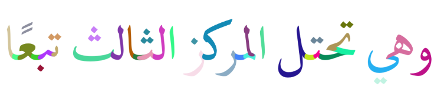

# Hamza

Hamza is a Header-Only, Fast and Portable C99 [Unicode](https://www.unicode.org)/[OpenType](https://docs.microsoft.com/en-us/typography/opentype/spec) shaping and rendering library. It's designed to be a small, 
portable and optimized shaper that's easy to integrate into any existing project. Below is an image of a short string of Arabic shaped with this library using a fairly complex font, random colors are assigned to each glyph.


## UCD File Generation
Hamza includes the single-file programs `update_ucd_ftp` and `generate_ucd_headers`. The first pulls the necessary UCD files from the FTP server at [ftp.unicode.org]() and requires [curl](https://github.com/curl/curl). The second generates optimized C headers from those UCD files. Both of these programs make use of the POSIX regex library for filtering and parsing. 

Download the UCD txt, this might take a few minutes so only do if UCD headers are out of date:
```sh
./build/update_ucd_ftp
```
Generate the header files for the UCD versions:
```sh
./build/generate_ucd_headers
```

## Getting Started 
To start using Hamza, define `HZ_IMPLEMENTATION` before including `hz.h`. You can optionally define `HZ_NO_STDLIB` for . It's also necessary to include the header for the UCD for the version you require.
We will explain later how these are generated and how you can update them yourself. 
```c
#define HZ_IMPLEMENTATION
#include <hz/hz_ucd_15_0_0.h>
#include <hz/hz.h>
```

To initialize the library first fill a `hz_config_t` struct and call `hz_init`:
```c
  hz_config_t cfg = {
  };

  if (hz_init(&cfg) != HZ_OK) {
      fprintf(stderr, "%s\n", "Failed to initialize Hamza!");
      return -1;
  }
```

  ### Loading Fonts
  Next, before you can shape any text you must provide font data. You want to load a font into a `stbtt_fontinfo` struct. Hamza includes `stb_truetype.h` which is intended to be used in reading fonts. To create a `hz_font_t` from a stbtt font, write:
  ```c
  hz_font_t *font = hz_stbtt_font_create(&fontinfo);
  ```

Hamza aims to let the user manage the memory allocation and the data as much as possible. Before shaping the font data has to be parsed into a `hz_font_data_t` struct. This holds all the OpenType table data required for shaping with a specific font. The `hz_font_data_init` function takes as argument how much memory will be allocated to hold that font's data:
```c
hz_font_data_t font_data;
hz_font_data_init(&font_data, 1024*1024); // 1MiB
hz_font_data_load(&font_data, font);
```
Create a shaper and initialize it:
```c
hz_shaper_t shaper;
hz_shaper_init(&shaper);
```
Set the shaper's required parameters:
```c
hz_shaper_set_direction(&shaper, HZ_DIRECTION_RTL);
hz_shaper_set_script(&shaper, HZ_SCRIPT_ARABIC);
hz_shaper_set_language(&shaper, HZ_LANGUAGE_ARABIC);
```
Set the shaper's typography features:
```c
hz_feature_t features[] = {
      HZ_FEATURE_ISOL,
      HZ_FEATURE_INIT,
      HZ_FEATURE_MEDI,
      HZ_FEATURE_FINA,
      HZ_FEATURE_RLIG,
      HZ_FEATURE_LIGA,
};

hz_shaper_set_features(&shaper, features, sizeof(features)/sizeof(features[0]));
```
Create glyph buffer and shape!
```c
hz_buffer_t buffer;
hz_buffer_init(&buffer);
hz_shape_sz1(&shaper, &font_data, HZ_ENCODING_UTF8, "السلام عليكم", &buffer);
```
After this, you can access the buffer's glyph data and render. After you are done with everything you have to deinitialize.
```c
hz_buffer_release(&buffer);
hz_font_data_release(&font_data);
hz_font_destroy(font);
hz_deinit();
```

## Tested Compilers
  - GCC 10.3.0 x86_64-w64-wingw32
  - GCC 10.3.0 x86_64-w64-wingw32 (mingw64)
  - MSVC 19.35.32217.1
  - MSVC 19.29.30148.0
  - Clang 16.0.0 x86_64-pc-windows-msvc


  ## Features
- [x] Joining script support and RTL writing
- [x] Kerning
- [x] Ligatures
- [x] Support for new [OpenType language tags](https://docs.microsoft.com/en-us/typography/opentype/spec/languagetags) (mixture of [ISO 639-3](https://iso639-3.sil.org/) and [ISO 639-2](https://www.loc.gov/standards/iso639-2/php/code_list.php) codes)
- [ ] Vertical layout Support (mostly for CJK, Mongolian, etc...)
- [ ] Color Emojis
- [ ] Emoji Combinations
- [ ] Multi-Threading
- [x] Unicode Normalization (NFC,NFD,NFKC,NFKD)
- [ ] Open `.aat` `.woff` and `.woff2` formats


## LICENSE
Hamza is licensed under MIT license.
