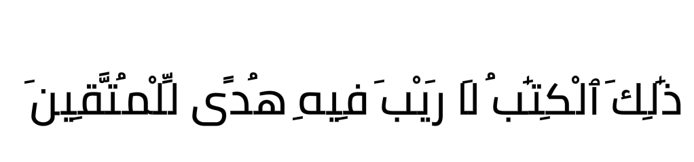
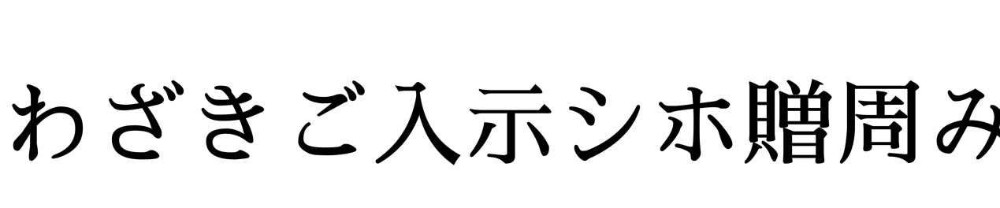

# Hamza
Hamza is a lightweight, fast and portable C90 [OpenType](https://docs.microsoft.com/en-us/typography/opentype/spec) library.
It was written to be primarily for Arabic but supporting other languages ended up not being too bad.
Latin scripts are mostly simple, some of them are a bit more complicated like Vietnamese.

## Supported Languages
- [x] Arabic
- [x] English
- [ ] French
- [ ] Japanese
- [ ] Chinese
- [ ] Korean
- [ ] Russian
- [ ] Urdu

## Feature Support
- [x] RTL
- [x] Ligatures
- [ ] Kerning
- [ ] Vertical Layouts (for Kanji)
- [ ] Emojis
- [ ] Justification

