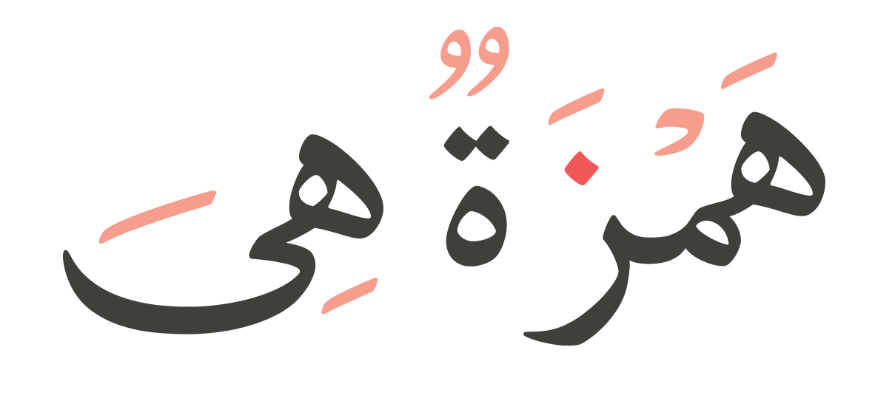

# Hamza
Hamza is a lightweight, fast and portable C89 [OpenType](https://docs.microsoft.com/en-us/typography/opentype/spec) library.
It was written to be primarily for Arabic (Complex Shaping) but also supports Basic Scripts (Latin, Greek, etc...).
However I do wish it to support more languages and writing systems.

# Documentation
https://saidwho12.github.io/hamza/

## TODO
- [x] RTL
- [x] Ligatures
- [ ] Kerning
- [ ] Vertical Layouts (for Kanji)
- [ ] Emojis
- [ ] Justification
- [ ] Multi-Threading (TinyCThread?)
- [ ] BCP47 Parser
- [x] Documentation (Natural Docs)
