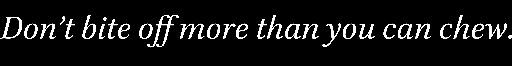

# Hamza

Hamza is a light-weight, fast and portable C99 [OpenType](https://docs.microsoft.com/en-us/typography/opentype/spec) shaping and rendering library. It's built alongside the [stb_truetype.h](https://github.com/nothings/stb) TrueType library as opposed to FreeType. It's designed to be small,    
portable and optimized shaper that's easy to include into an existing project and use.


## Goal
Originally Hamza was a research project to learn about font shaping for an application I had in mind.    
Later, with much research and work I have only developed more fascination with the shaping process and possible strategies of     
optimization. In 2021, after a few months of working on Hamza, there was the [Refterm](https://github.com/cmuratori/refterm) controversy which resulted in a lot of discussion    
about text shaping and rendering being slow, overcomplicated and just a mess. My philosophy with the project is based on [Casey Muratori's talk on Optimization](https://www.youtube.com/watch?v=pgoetgxecw8) and    
inspired by minimalist libraries such as [Dear ImGui](https://github.com/ocornut/imgui).

Hamza as of now only has 6 files and I intent to keep this number low. Similarly, the number of lines of code is low compared to other projects at ~12kloc.    
It can easily be included in any project and built alongside other source files, or you can build Hamza as a module.    
The goal is a non-pessimized, small and simple shaping library that can easily be included into any existing project.    
The intent is to optimize lookup application slow paths using SIMD + multi-threading while keeping the code as simple and clear as possible.  A lot of people think that shaping is a linear process and very difficult to multi-thread, this couldn't be further from the case. GSUB table single substitution is a perfect use-case for multi-threading, Unicode parsing can be vectorized, things like ligature matching can be optimized with SSE. It turns out that shaping can be done cleanly and efficiently.

## Hello, World!

Brief example rendering a simple phrase using Hamza + stb_truetype.

Firstly, setup the library with `hz_setup()`. This is required as this has the job of optimizing the library and initializing some important state. Then create a font from a `stbtt_fontinfo` reference.
```  
stbtt_fontinfo fontinfo = load_font("Brill-Italic.ttf");  
hz_font_t *font = hz_stbtt_font_create(&fontinfo);  
```  

Create a text segment and assign it's properties such as language, script and direction.
```  
hz_segment_t *seg = hz_segment_create();  
hz_segment_set_direction(seg, HZ_DIRECTION_LTR);  
hz_segment_set_script(seg, HZ_SCRIPT_LATIN);  
hz_segment_set_language(seg, HZ_LANGUAGE_ENGLISH);  
```  

Once you create a text segment and set it's properties, you can parse Unicode characters from various encodings such as ASCII, UCS2, UTF-8, and others.

```  
hz_segment_load_ascii("Don’t bite off more than you can chew.");  
```  

Define the features you want to apply, if none are provided Hamza will use the script's default features.
```  
hz_feature_t features[] = {  
    HZ_FEATURE_CALT, // contextual alternates  
    HZ_FEATURE_LIGA, // ligatures    
    HZ_FEATURE_DIGA, // discretory ligatures    
    HZ_FEATURE_KERN // kerning    
};    
    
// shape    
hz_shape(font, seg, features, 4);  
```  

Of course, when are done with these objects you have to free them.

Result:  


## Features
- [x] Joining script support and Right-To-Left writing
- [x] OpenType Kerning
- [x] Ligatures
- [x] Support for new [OpenType language tags](https://docs.microsoft.com/en-us/typography/opentype/spec/languagetags) (mixture of [ISO 639-3](https://iso639-3.sil.org/) and [ISO 639-2](https://www.loc.gov/standards/iso639-2/php/code_list.php) codes)
- [ ] Support for old Two-Letter [ISO 639-1:2002](https://id.loc.gov/vocabulary/iso639-1.html) language tags (same as HarfBuzz)
- [ ] Vertical layout (i.e. for Chinese)
- [ ] Emojis
- [ ] Multi-Threading
- [ ] No C-runtime depencency mode for Embedded (?)
- [ ] Add Vcpkg script for windows.

## Misc
_Developed and maintained by Saïd Metiche._