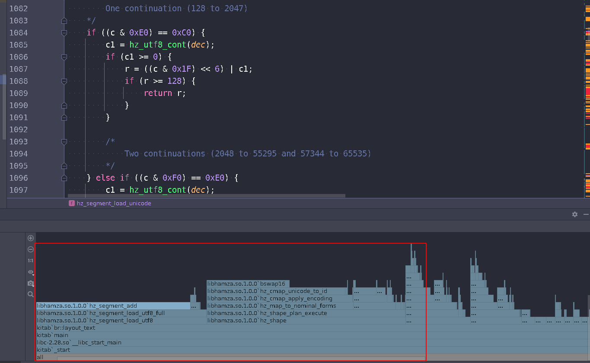

- Speed up UTF-8 decoder (using pre-computed tables/SIMD)
  - [IBM paper on SIMD speedup of UTF-8 decode algorithm](https://researcher.watson.ibm.com/researcher/files/jp-INOUEHRS/IPSJPRO2008_SIMDdecoding.pdf)
  - [C example of fast UTF-8 decoder](https://gist.github.com/gorb314/7888804)
- Speed up hz_segment_t structure, try plain buffer rather than a doubly linked list (O(n) search time and push time is terrible)
- Speed up bswap16 when parsing, swap bytes in large chunks (using SIMD, or types which are larger than uint16_t and bitwise operations to)
- Write a proper pool allocator for internal allocations
- Cache calls to hz_shape()
- Add loading from UTF-16, Windows-1252 (CP1252), etc...
